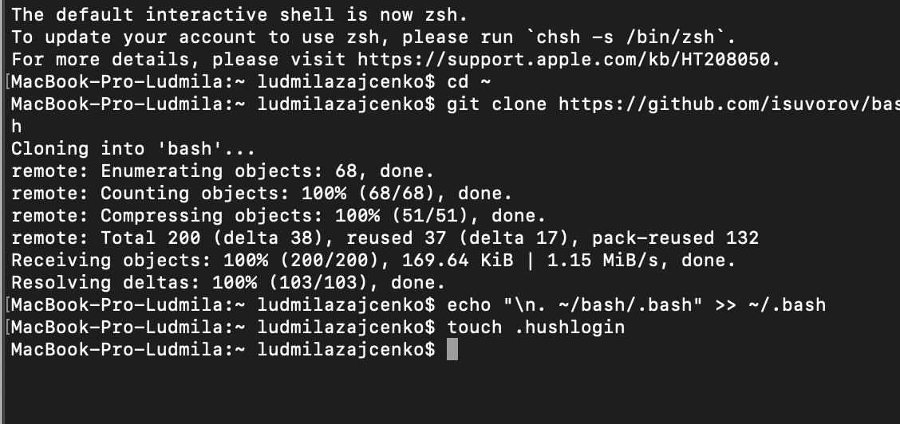
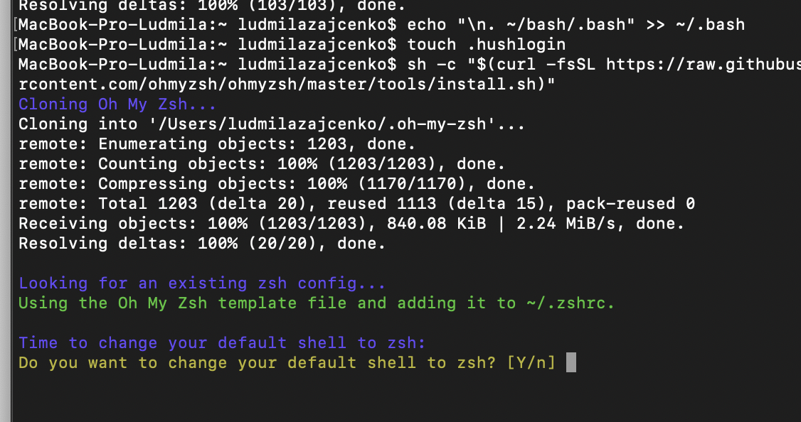
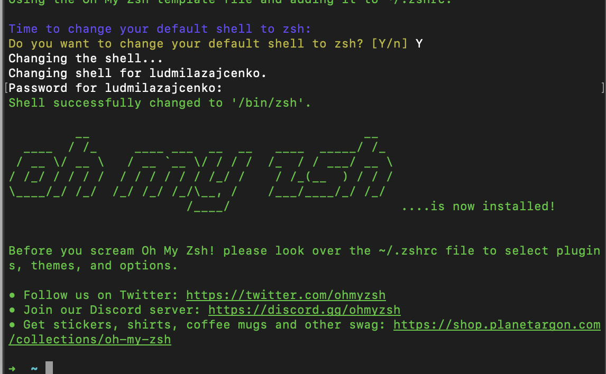
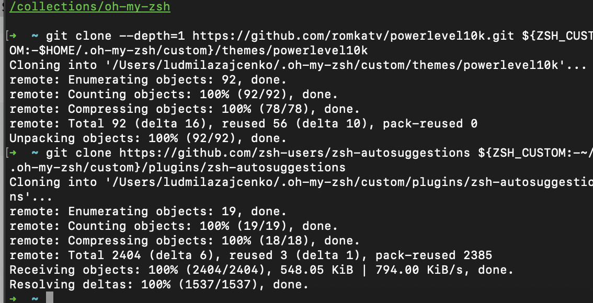
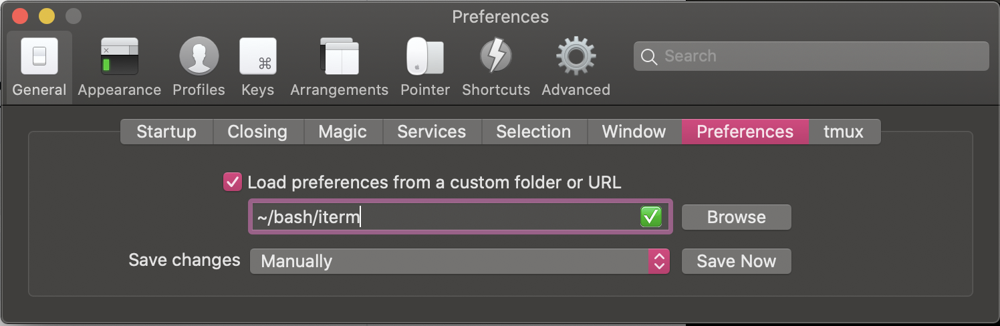
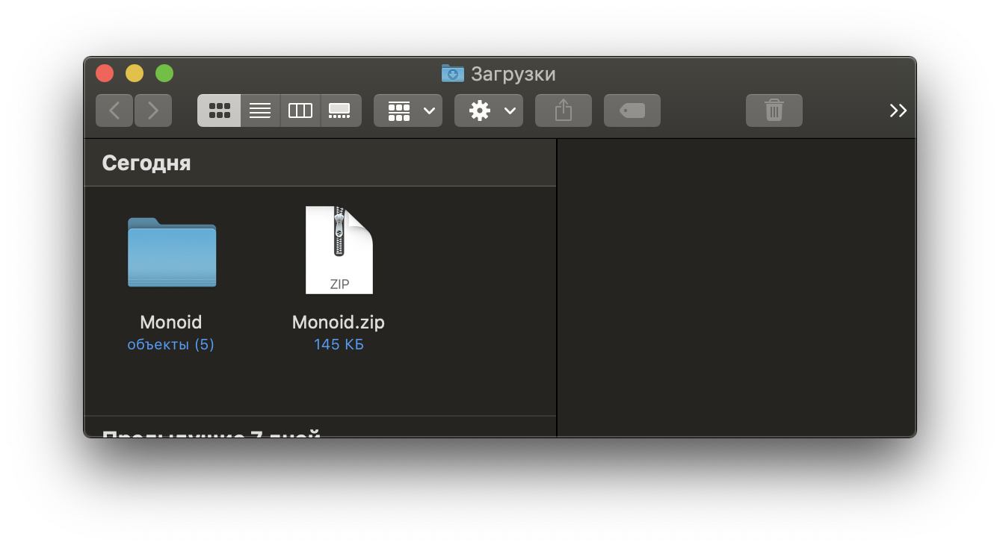
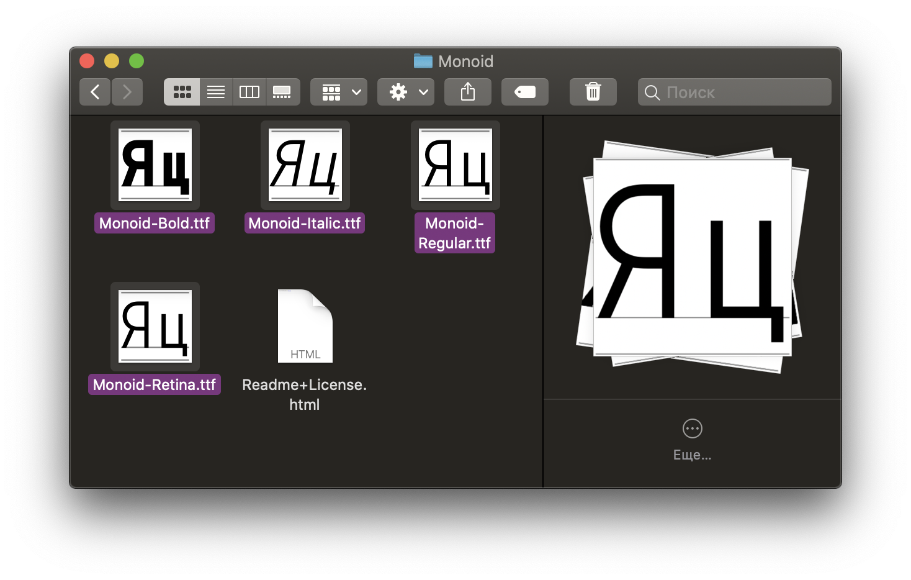
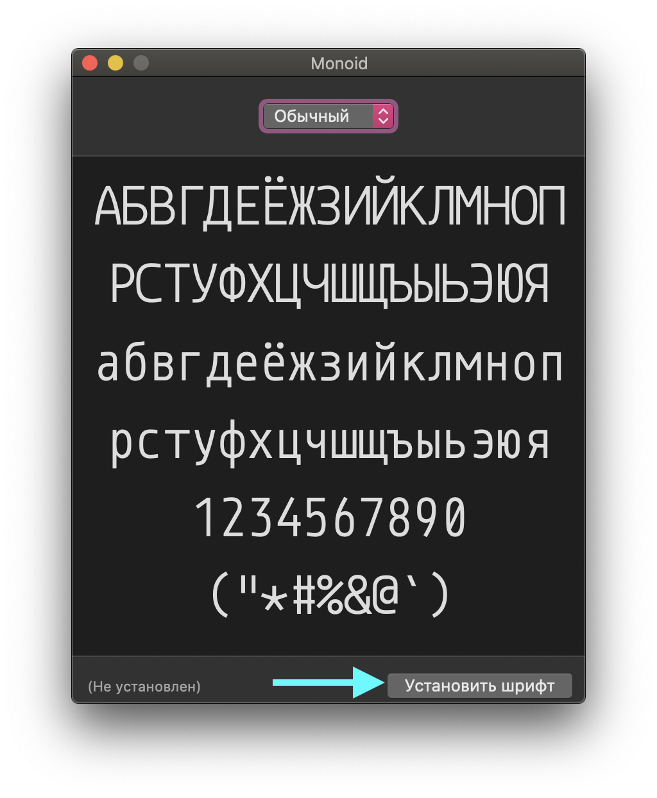
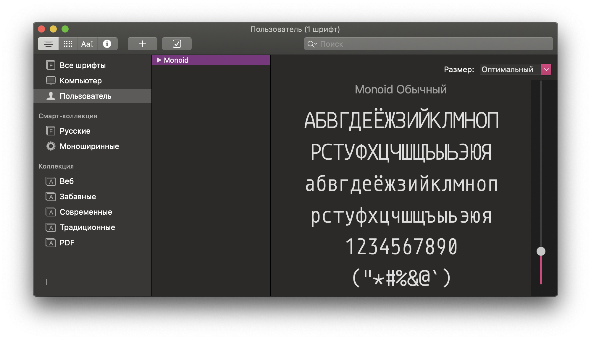

# 🎓 Terminal Starter Kit
 iTerm2, oh-my-zsh, BASH & ZSH Aliases

Its the part of [🎓 MacOS Starter Kit](https://github.com/isuvorov/notes)

# Quickstart

Autoinstall script
```bash
/bin/bash -c "$(curl -fsSL https://raw.githubusercontent.com/isuvorov/bash/HEAD/autoinstall.sh)"
```

## Prepare iTerm or other Terminal App

Install iTerm via Homevrew:
```bash
brew install iterm2
```
[More info about Homebrew and iTerm](https://github.com/isuvorov/notes/blob/master/apps.md)

### 0. check git utils

```bash
git --version
```

Install git and xcode-select if need

### 1. clone repo in home
```bash
cd ~
git clone https://github.com/isuvorov/bash
```

Clone to the root folder, do everything as in the screenshot:
<p align="left">
  
</p>


### 2. add `. ~/bash/.bash` in `~/.bash`

```bash
echo "\n. ~/bash/.bash" >> ~/.bash
```

*Tips*: How to disable messages about "last login"

```bash
touch ~/.hushlogin
```


### 3. Install oh-my-zsh

See: https://github.com/ohmyzsh/ohmyzsh
```bash
sh -c "$(curl -fsSL https://raw.githubusercontent.com/ohmyzsh/ohmyzsh/master/tools/install.sh)"
```
Confirm the switching to zsh after installation:
<p align="left">
  
</p>

Get as a result:
<p align="left">
  
</p>

### 4. Install Powerlevel10k theme and zsh-autosuggestions plugin

See: https://github.com/romkatv/powerlevel10k
```bash
git clone --depth=1 https://github.com/romkatv/powerlevel10k.git ${ZSH_CUSTOM:-$HOME/.oh-my-zsh/custom}/themes/powerlevel10k
git clone https://github.com/zsh-users/zsh-autosuggestions ${ZSH_CUSTOM:-~/.oh-my-zsh/custom}/plugins/zsh-autosuggestions
```
Get as a result:
<p align="left">
  
</p>

### 5. add `. ~/bash/.zshrc` in `~/.zshrc`

```bash
echo "\n. ~/bash/.zshrc" >> ~/.zshrc
```

### 6. iTerm2  (Bonus)

Install [iTerm2](https://iterm2.com/) if you dont have.

iTerm2 Preferences > Tab General > Sub Tab Preferences > Load preferences ... > enable

fill `~/bash/iterm`

<p align="left">
  
</p>

### 6.1 Install the font
Click on the [link] (https://larsenwork.com/monoid/) to download the Monoid font.
Unpack the archive, go to the folder.

<p align="left">
  
</p>

Select files with the ttf extension, double-click on any of the selected files and install the font.

<p align="left">
  
</p>

<p align="left">
  
</p>

The Font Book (Шрифты) program should open itself

<p align="left">
  
</p>

Close this program, everything is ready :) 

### 7. Restart the terminal and enjoy :)

<p align="left">
  
</p>

### Aliases 
#### Open sourcetree from command line with our aliases

Open app
```bash
$ st
```
<br/>

Open project's folder
```bash
$ st NAME_PROJECT_FOLDER
```
<br/>

Open current project folder
```bash
$ st .
```
<br/>
<br/>

#### Open IDE from command line with our aliases

Open VS Code
```bash
$ c
```
<br/>

Open current project folder in VS Code
```bash
$ s
```
or
```bash
$ sublime
```
or
```bash
$ subl
```
<br/>

Open Sublime Text
```bash
$ c
```
<br/>

Open Finder
```bash
$ o
```
<br/>
<br/>

#### NPM's aliases

npm run dev
```bash
$ nd
```
<br/>

npm run devserver
```bash
$ nds
```
<br/>

npm run release
```bash
$ np
```
<br/>

Remove node_modules and reinstall
```bash
$ nrf
```
<br/>


## Aliases


### Open
- `o <directory>` - открыть директорию в Finder
- `o.` - открыть текушую директорию в Finder

### VSCode
- `c <directory|file>` - открыть директорию или файл в VSCode
- `c.` - открыть текушую директорию в VSCode

### Sublime Text
- `subl <directory|file>` - открыть директорию или файл в Sublime Text
- `subl.` - открыть текушую директорию в Sublime Text

### SourceTree
- `st <directory|file>` - открыть директорию или файл в SourceTree
- `st.` - открыть текушую директорию в SourceTree

### GIT
- `gc <MESSAGE>` - альяс для быстрого git commit
- `gitfix <MESSAGE?>` - альяс для `git add .`  + `git commit` + `git push`. Позволяет быстро "залить" всю, фигню что ты наворотил. Сообщене можно не указывать.
- `gf <MESSAGE?>` - сокращение для gitfix
- `gr` - откатиться на предыдущий коммит, выкинув все файлы которые ты изменил. Файлы которые ты уже добавил в стеш git add, сохранятся.
- `gclone <URL>` - тоже самое что и git clone, но `github.com/isuvorov/fishbird` клонируется в папку `isuvorov-fishbird` а не просто `fishbird`

### Open Github or Gitlab
- `gitlab` - открыть в браузере текущий коммит. Работает как с gitlab, так и с github. Актуально для того, чтобы смотреть за прогрессом CI. Пример: что-то поменяли, `gitfix && gitlab` - открывается браузер, и вы смотрите как движется пайп.


### Node.js


- `p` - альяс для pnpm (чтобы не писать лишние 3 символа)
- `pi` - альяс для pnpm install
- `px` - альяс для pnpm dlx/pnpx (аналог npx). Который позволяет запускать бинарник, без предварительной установки в global (npm i -g)

- `nd` - альяс для `npm run dev` - те запуска в дев среде
- `nb` - альяс для `npm run build`-- те сборка проекта
- `nt` - альяс для `npm run test` -- те тест проекта
- `ntw` - альяс для `npm run test --watch` - те для запуска тестов в дев режиме
- `nbt` - альяс для `npm run build --prod && npm run test --prod` - те собери проект в прод режиме и затем протестируй его
- `nu` - альяс для `pnpm update -i --latest` -- те проверяет какие пакеты можно обновиться. (Если изменения - патчи (меняется последняя цифра в v1.2.3) обновляет автоматом, если минорные/мажорные - показывает интерактивное окно)
- `nur` - тоже самое что и `nu`, но в том числе для всех пакетов
- `np` - альяс для `npm run release` - те заливки пакета в npm, перед заливкой он попросит апрува написать `Y`, что он всё правильно понял
- `npp` - альяс для `npm run release --yes` - те заливки пакета в npm, с автоапрувом


### Inspiration

https://udaraw.com/iterm-plugins/