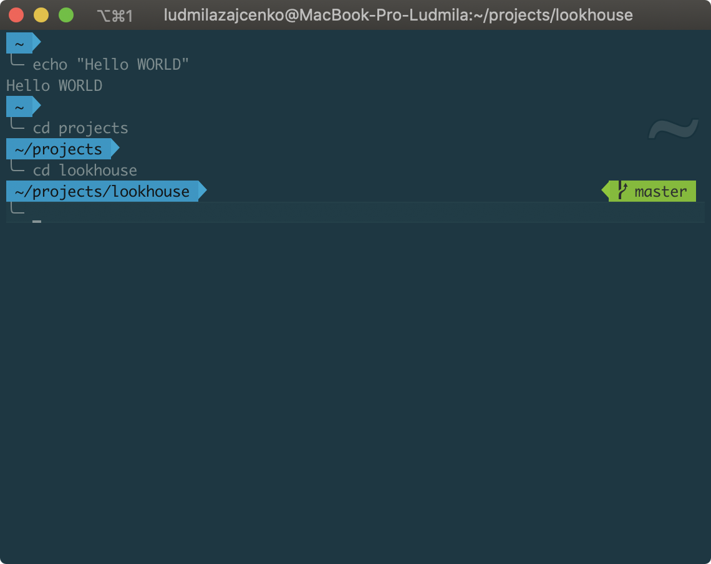

# Bash configs
Bash aliases, zsh/oh-my-zsh config and shell utilites

### 1. clone repo in home
```sh
cd ~
git clone https://github.com/isuvorov/bash
```
Clone to the root folder, do everything as in the screenshot:
<p align="left">
  
</p>


### 2. add `. ~/bash/.bash` in `~/.bash`

```sh
echo "\n. ~/bash/.bash" >> ~/.bash
```

*Tips*: How to disable messages about "last login"

```sh
touch .hushlogin
```


### 3. Install oh-my-zsh

See: https://github.com/ohmyzsh/ohmyzsh
```sh
sh -c "$(curl -fsSL https://raw.githubusercontent.com/ohmyzsh/ohmyzsh/master/tools/install.sh)"
```
Confirm the switching to zsh after installation:
<p align="left">
  
</p>

Get as a result:
<p align="left">
  
</p>

### 4. Install Powerlevel10k theme and zsh-autosuggestions plugin

See: https://github.com/romkatv/powerlevel10k
```sh
git clone --depth=1 https://github.com/romkatv/powerlevel10k.git ${ZSH_CUSTOM:-$HOME/.oh-my-zsh/custom}/themes/powerlevel10k
git clone https://github.com/zsh-users/zsh-autosuggestions ${ZSH_CUSTOM:-~/.oh-my-zsh/custom}/plugins/zsh-autosuggestions
```
Get as a result:
<p align="left">
  
</p>

### 5. add `. ~/bash/.zshrc` in `~/.zshrc`

```sh
echo "\n. ~/bash/.zshrc" >> ~/.zshrc
```

### 6. iTerm2  (Bonus)

Install [iTerm2](https://iterm2.com/) if you dont have.

iTerm2 Preferences > Tab General > Sub Tab Preferences > Load preferences ... > enable

fill `~/bash/iterm`

<p align="left">
  
</p>

### 6.1 Install the font
Click on the [link] (https://larsenwork.com/monoid/) to download the Monoid font.
Unpack the archive, go to the folder.

<p align="left">
  
</p>

Select files with the ttf extension, double-click on any of the selected files and install the font.

<p align="left">
  
</p>

<p align="left">
  
</p>

The Font Book (Шрифты) program should open itself

<p align="left">
  
</p>

Close this program, everything is ready :) 

### 7. Restart the terminal and enjoy :)

<p align="left">
  
</p>

#### How open sourcetree from command line with our aliases

```bash
$ st NAME_PROJECT_FOLDER
```
